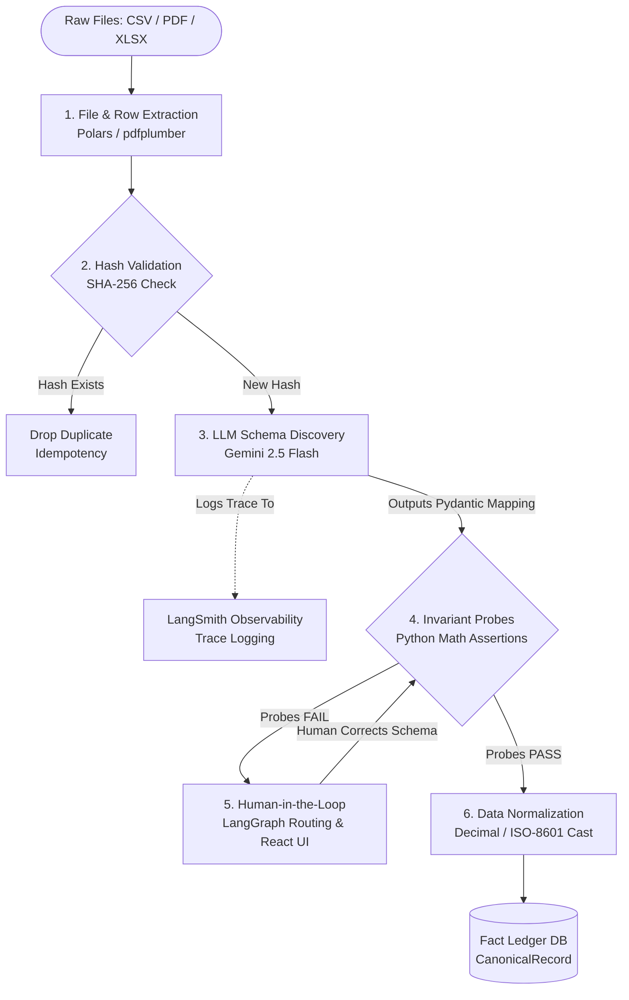
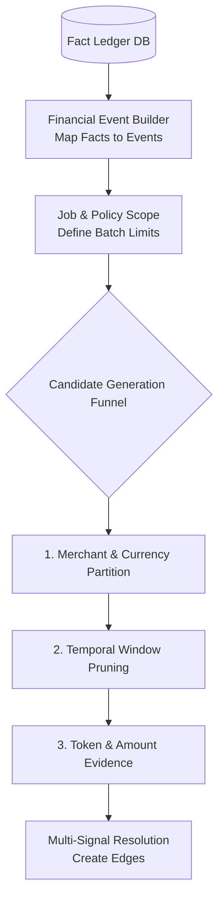
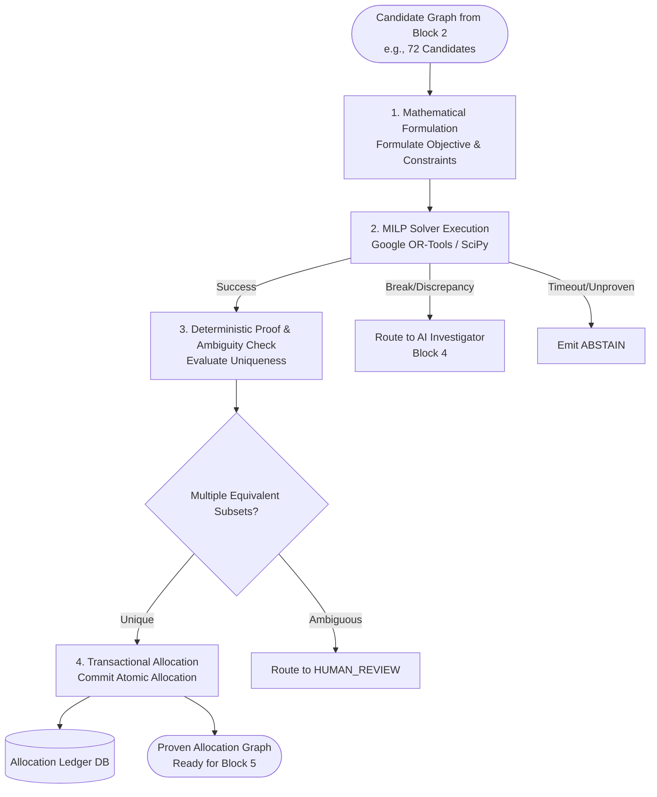
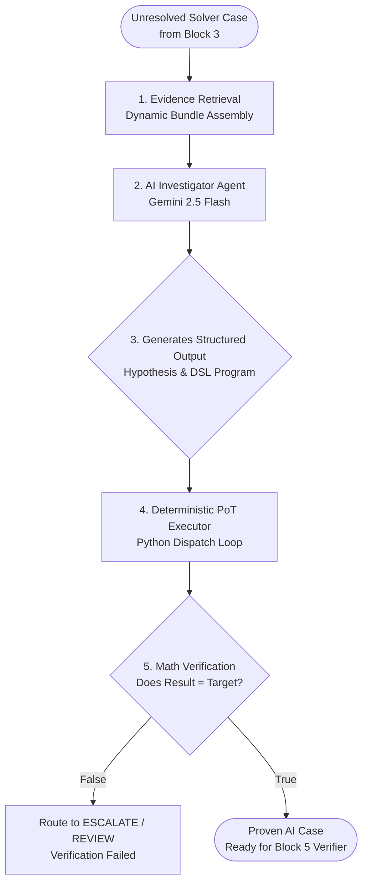
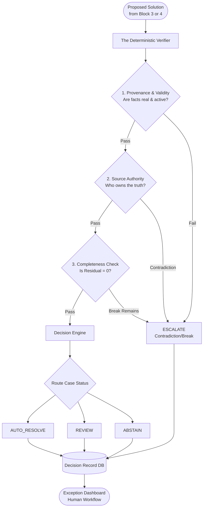

# LedgerGuard AI

LedgerGuard AI is an autonomous financial reconciliation engine designed to automatically match and reconcile high-volume financial events across multiple sources (e.g., ERP sales, Payment Gateways, and Bank Settlements) with extreme precision. 

When discrepancies occur (such as missing transactions, orphaned events, or data quality errors), LedgerGuard AI utilizes a built-in AI Investigator powered by Gemini 2.5 Flash to automatically dissect the financial graph, propose an economic hypothesis for the anomaly, and present it to human operators in a streamlined "Forensic Queue" for one-click manual resolution.

## Architecture & Pipeline Blocks

LedgerGuard AI is composed of 5 distinct orchestration blocks that run sequentially to guarantee data integrity and deterministic outcomes.

### Block 1: Data Ingestion & Extraction
Responsible for extracting raw, messy financial data and normalizing it into a strict canonical format using deterministic math assertions and LLM schema discovery.



### Block 2: Candidate Generation Funnel
Responsible for shrinking the massive search space. It creates small, high-probability bipartite graphs between candidate source events and target deposit events.



### Block 3: Mathematical MILP Solver
Executes Mixed-Integer Linear Programming against the candidate graphs to mathematically prove 1:1, 1:N, or N:M matches without hallucination.



### Block 4: AI Investigator
An autonomous Agent (Gemini 2.5 Flash) that analyzes unresolved solver cases, hypothesizes economic anomalies (like missing fees or orphaned records), and writes a deterministic Program-of-Thought DSL to prove its hypothesis.



### Block 5: The Deterministic Verifier
The final safety checkpoint. It accepts proposed matches from the MILP Solver or the AI Investigator, strips away their reasoning, and verifies provenance, source authority, and completeness from scratch.


- **Interactive Forensic Queue**: A beautiful, dynamic React dashboard to visualize orphaned clusters side-by-side, view the AI's hypothesis, and securely push manual adjustments and force-matches to the immutable ledger.
- **Real-Time Insights**: A live dashboard displaying auto-match rates, total reconciled volume, and trailing 7-day trend analysis.

## Repository Structure

- `backend/`: The FastAPI backend, Postgres/SQLite database models, Multi-Agent solver, and API endpoints.
- `frontend/`: The Vite + React dashboard, utilizing `recharts` and `lucide-react`.
- `Testing_data/`: A collection of 444 synthetic financial records across 3 tiers (ERP Export, Razorpay Recon, and Bank Statement) designed to simulate real-world e-commerce accounting.

## Prerequisites

- Python 3.13+ (using `uv` for dependency management)
- Node.js 18+ (for running the Vite React frontend)

## Installation and Setup

### 1. Clone the repository
```bash
git clone https://github.com/HemishJain09/Ledgerguard-AI.git
cd Ledgerguard-AI
```

### 2. Backend Setup
```bash
cd backend
# Install dependencies using uv
uv sync
```

Create a `.env` file in the `backend/` directory with your API keys:
```env
GROQ_API_KEY="your_groq_api_key_here"
LANGCHAIN_API_KEY="your_langchain_api_key_here"
LANGCHAIN_TRACING_V2="true"
LANGCHAIN_ENDPOINT="https://api.smith.langchain.com"
LANGCHAIN_PROJECT="LedgerGuard-AI"
GEMINI_API_KEY="your_gemini_api_key_here"
DATABASE_URL="sqlite:///./ledger.db"
```

### 3. Frontend Setup
```bash
cd ../frontend
npm install
```

## Running the Application

You will need two terminal tabs to run both servers concurrently.

**Terminal 1: Start the Backend Server**
```bash
cd backend
uv run uvicorn server:app --reload --port 8000
```
*The API will be available at `http://localhost:8000`*

**Terminal 2: Start the Frontend UI**
```bash
cd frontend
npm run dev
```
*The Dashboard will be available at `http://localhost:5173`*

## Demo Walkthrough

1. Open `http://localhost:5173` in your browser.
2. In the **Dashboard** view, under "Demo Ingestion Sources", click the ingest buttons sequentially:
   - **Ingest ERP Export**
   - **Ingest Razorpay Recon**
   - **Ingest Bank Statement**
3. Once all files are ingested, click **Run Auto-Reconciliation Engine**. The background solver will execute the MILP algorithms and allocate the matches.
4. Navigate to the **AI Forensic Queue** in the sidebar.
5. You will see mathematically orphaned clusters that failed automatic resolution. The AI Investigator will present its hypothesis for *why* the records failed to match (e.g., "Missing Record" or "Data Quality Error").
6. Check the candidate boxes you wish to map, enter an adjustment if needed, and click **Force Match & Clear** to manually resolve the anomaly.

## License
MIT License
